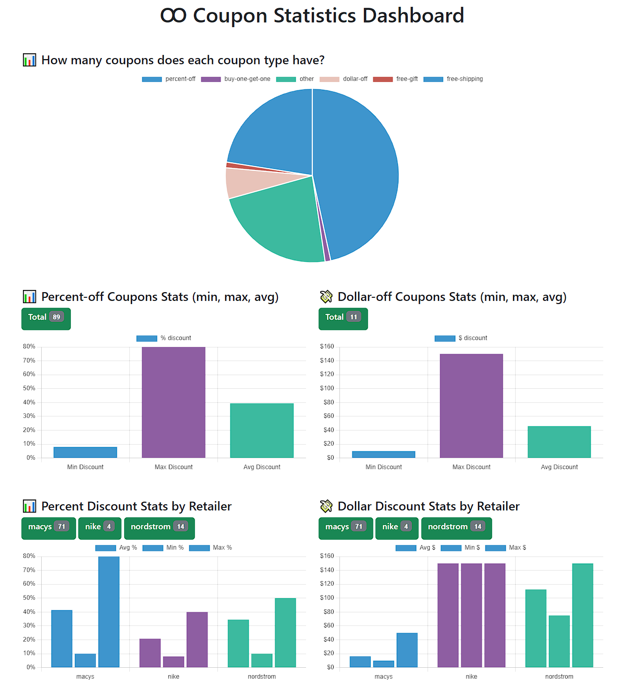

# Coupon Statistics Dashboard

This Django project provides a Chart.js dashboard to visualize statistics related to coupons extracted from JSON to the SQLite DB using ORM, Django templates, views and models. No serializers.



- Includes custom models, migrations, and import script for coupons.json
- 4 REST API endpoints to see a few stats about the coupons, using the Django ORM.
- Bootstrap+Chart.js web dashboard, using Django template on the view, and Django webserver. Bit of chart interactivity: can hide/show labels in pie chart.
- Custom models but no serializers, since this is read-only and needs no computed fields.
- All your base are belong to us.

## Setup and Execution on Ubuntu
If using Windows, I recommend using WSL2, although you can also use MinGW.
I'm using the latest stable Python (3.8) and Django (4.2.5) that Ubuntu provides with apt.

This might help you: https://www.digitalocean.com/community/tutorials/how-to-install-the-django-web-framework-on-ubuntu-22-04

1. **Clone the Repository**:
   ```
   git clone [URL_TO_YOUR_REPO]
   cd [YOUR_REPO_NAME]
    ```
2. **Setup a Virtual Environment**:
    ```
    sudo apt-get install python3-venv
    python3 -m venv venv
    source venv/bin/activate
    ```
3. **Install Dependencies**:
    ```
    pip install -r requirements.txt
    ```
4. **Run restart_database.sh** which will execute makemigrations, the migrations, and the import_coupons.py script. The coupons.json must be on the root dir.
    ```
    ./restart_database.sh
    ```

5. **Start the Development Server:**
    ```
    python manage.py runserver
    ```


## Features

1.  **Dashboard**: 
   - **GET** (website): `/`
   - **Description**: Single Page App displays a simple Chart.js dashboard from data generated using only views and templates from Django, and a bit of bootstrap.

2. **Coupon Type Count**: 
   - **GET** (JSON): `/stats/count`
   - **Description**: Shows how many coupons each coupon type has.
```
[
    {
        "name": "percent-off",
        "count": 89
    },
    {
        "name": "buy-one-get-one",
        "count": 2
    },
    {
        "name": "other",
        "count": 44
    },
    {
        "name": "dollar-off",
        "count": 11
    },
    {
        "name": "free-gift",
        "count": 2
    },
    {
        "name": "free-shipping",
        "count": 43
    }
]
```

3. **Percent-Off Coupon Stats**:
   - **GET** (JSON): `/stats/percent-off`
   - urls.py: `stats/<str:promotion_type>`
   - **Description**: Displays the number of coupons with discount, the minimum discount, maximum discount, and average discount for percent-off coupons.
```
{
    "num_coupons": 89,
    "min_discount": 8,
    "max_discount": 80,
    "avg_discount": 39.39
}
```

4. **Dollar-Off Coupon Stats**:
   - **GET** (JSON): `/stats/dollar-off`
   - urls.py: `stats/<str:promotion_type>`
   - **Description**: Same as above but for dollar-off coupons.
```
{
    "num_coupons": 11,
    "min_discount": 10,
    "max_discount": 150,
    "avg_discount": 45.91
}
```
5. **Percent-Off Coupons by Retailer**:
   - **GET** (JSON): `/stats/percent-off/retailers`
   - urls.py: `stats/<str:promotion_type>/retailers`
   - **Description**: Displays the same values as the percent-off stats but groups them by retailer.
```
[
    {
        "webshop": "macys",
        "num_coupons": 71,
        "min_discount": 10,
        "max_discount": 80,
        "avg_discount": 41.41
    },
    {
        "webshop": "nike",
        "num_coupons": 4,
        "min_discount": 8,
        "max_discount": 40,
        "avg_discount": 20.75
    },
    {
        "webshop": "nordstrom",
        "num_coupons": 14,
        "min_discount": 10,
        "max_discount": 50,
        "avg_discount": 34.5
    }
]
```
6. **Dollar-Off Coupons by Retailer**:
   - **GET** (JSON): `/stats/dollar-off/retailers`
   - urls.py: `stats/<str:promotion_type>/retailers`
   - **Description**: Same as above but for dollar-off coupons.
```
[
    {
        "webshop": "macys",
        "num_coupons": 8,
        "min_discount": 10,
        "max_discount": 50,
        "avg_discount": 16.25
    },
    {
        "webshop": "nike",
        "num_coupons": 1,
        "min_discount": 150,
        "max_discount": 150,
        "avg_discount": 150
    },
    {
        "webshop": "nordstrom",
        "num_coupons": 2,
        "min_discount": 75,
        "max_discount": 150,
        "avg_discount": 112.5
    }
]
```
7. **Admin CRM**
   - **GET** (website): `/admin`
   - **Description**: Don't forget that Django also provides `/admin` style CRM web client to manage the models among many tools, and you only will need to create a superuser just after running `restart_database.py`, and then do:

`python manage.py createsuperuser`

## How is it made
I implemented three models: `Coupon, PromotionType, WebShop`.
Each coupon must have a promotion type, and a webshop assigned, too.
Thus, each coupon has a FK of the PromotionType, and Webshop ID's

After the migration and import script (restart_database.py) has ran, we can test this.
First, launch the Django shell:

```
python manage.py shell
```

Now you can check if all the data is there in the DB, and play around with the ORM.

```
from couponstats.models import Coupon, PromotionType, Webshop
# For Coupon
print(Coupon.objects.all())

# For PromotionType
print(PromotionType.objects.all())

# For Webshop
print(Webshop.objects.all())
```

The views work both as API rest endpoints and data functions to generate the `all_stats.html` template. This HTML is a fairly simple Bootstrap flex layout with Chart.js, using their current stable CDNs.
Remember to start the webserver and jump right into it:
```
python manage.py runserver
```

## License
See LICENSE.txt

```
GNU GPLv3

Permissions of this strong copyleft license are conditioned on making available complete source code of licensed works and modifications, which include larger works using a licensed work, under the same license. Copyright and license notices must be preserved. Contributors provide an express grant of patent rights.
```